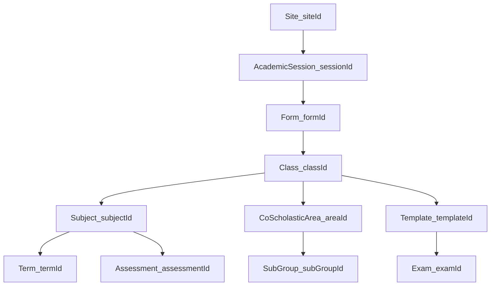

# Filters_teacher — cross-module filter API catalog

Central catalog of teacher-app filter and dropdown APIs, aligned to Figma catalog section **[`1837:16870`](https://www.figma.com/design/iv4SFTxeHwgBYQ6TNhydaL/Shriconnect-Staff-App?node-id=1837-16870)**.

File key: `iv4SFTxeHwgBYQ6TNhydaL` (Shriconnect Staff App)

## Naming

```
{node-id}--{filter-slug}.json
```

Each contract includes: `screen`, `description`, `figmaNodeId`, `request`, `response`, `example_request`, `example_response`, `notes`.

## Response shape

Most filters return paginated options:

```json
{
  "data": [{ "id": "string", "label": "string" }],
  "total": "number",
  "page": "number",
  "limit": "number"
}
```

Optional item fields: `formLevel`, `section`, `value`, `curriculum`.

## Dependency chains

See [`_filter-dependency-map.json`](_filter-dependency-map.json) for machine-readable chains.



| Chain | Steps | Modules |
|-------|-------|---------|
| Academic hierarchy | Site → Session → Form → Class → Subject | Assessment, Attendance, Calendar, Teachers Diary |
| Manual Attendance | Form → Class → Template → Exam (+ Subject) | Manual Attendance setup |
| Co-Scholastic | Class → Area → Sub-Group | Co-Scholastic |
| Class Schedule | Session + Class + Date + Subject (all required) | Attendance hub |
| Student Leave | Class → Students; LeaveType; LeaveReason | Student Leave |
| Teachers Diary | Class → Subject → Sub-Topic | Teachers Diary |

## Folder layout

| Folder | Filters |
|--------|---------|
| [`shared/`](shared/) | Site, academic session, form, class, subject, term, academic year |
| [`assessment/`](assessment/) | Grades, co-scholastic area/sub-group, assessment, element, aspect, template, exam |
| [`attendance/`](attendance/) | Class schedule session, mark session, period, date preset, sort, staff-leave class |
| [`student-leave/`](student-leave/) | Class, students, leave type, leave reason |
| [`staff-leave/`](staff-leave/) | Class, leave type tab |
| [`assignments/`](assignments/) | Class, date, submissions module |
| [`calendar/`](calendar/) | Category, form, class |
| [`teachers-diary/`](teachers-diary/) | Class, subject, sub-topic, status |
| [`resource-management/`](resource-management/) | Resource group, status |
| [`resource-booking/`](resource-booking/) | Resource group |
| [`red-book/`](red-book/) | Type, location, date range |
| [`lesson-plan/`](lesson-plan/) | Class |
| [`health-room/`](health-room/) | Class, sort by |

## Index

- [`_figma-filter-index.json`](_figma-filter-index.json) — flat list of all 46 filters
- [`_filter-dependency-map.json`](_filter-dependency-map.json) — dependency chains + filter metadata

## Shared vs module copies

Module-specific class/subject filters (e.g. `assignments/`, `teachers-diary/`) may duplicate `shared/` contracts when the backend path differs. Check `notes.canonicalShared` for the shared canonical file.

## Consuming screens

Module screen contracts under `api-screens/` should reference filter paths from this catalog in `notes.filterContract` when a chip opens a dropdown API.

Example: Assessment marks setup → `shared/7133-150449--class-filter.json`, `shared/7133-150532--subject-filter.json`.
