# Assessment module — API screen contracts

Figma module root: **[Assessment `19230:56644`](https://www.figma.com/design/iv4SFTxeHwgBYQ6TNhydaL/Shriconnect-Staff-App?node-id=19230-56644)**

File key: `iv4SFTxeHwgBYQ6TNhydaL` (Shriconnect Staff App)

## Naming convention

Each contract file maps Figma → JSON in one step:

```
{node-id}--{screen-slug}.json
```

Example: `19230-57503--student-profile-roster.json` → Figma node [`19230:57503`](https://www.figma.com/design/iv4SFTxeHwgBYQ6TNhydaL/Shriconnect-Staff-App?node-id=19230-57503) (Student Profile section).

Every contract includes: `screen`, `description`, `figmaNodeId`, `request`, `response`, `example_request`, `example_response`, and `notes`.

## Module sections (Figma)

| Section node | Module | Folder |
|--------------|--------|--------|
| [`19230:56644`](https://www.figma.com/design/iv4SFTxeHwgBYQ6TNhydaL/Shriconnect-Staff-App?node-id=19230-56644) | Hub + shared filters | `_meta/`, `filters/` |
| [`19230:57503`](https://www.figma.com/design/iv4SFTxeHwgBYQ6TNhydaL/Shriconnect-Staff-App?node-id=19230-57503) | Student Profile | `student-profile/` |
| [`19230:57867`](https://www.figma.com/design/iv4SFTxeHwgBYQ6TNhydaL/Shriconnect-Staff-App?node-id=19230-57867) | Subject Profile | `subject-profile/` |
| [`19230:58630`](https://www.figma.com/design/iv4SFTxeHwgBYQ6TNhydaL/Shriconnect-Staff-App?node-id=19230-58630) | Marks | `marks/` |
| [`19230:59231`](https://www.figma.com/design/iv4SFTxeHwgBYQ6TNhydaL/Shriconnect-Staff-App?node-id=19230-59231) | Co-Scholastic | `co-scholastic/` |
| [`19230:59615`](https://www.figma.com/design/iv4SFTxeHwgBYQ6TNhydaL/Shriconnect-Staff-App?node-id=19230-59615) | Manual Attendance | `manual-attendance/` |

## Flow

```mermaid
flowchart TD
  Hub[Hub_19230_56644]
  Hub --> SP[StudentProfile_57503]
  Hub --> SubP[SubjectProfile_57867]
  Hub --> Marks[Marks_58630]
  Hub --> CS[CoScholastic_59231]
  Hub --> MA[ManualAttendance_59615]

  SP --> SPSetup[Setup class/term + element]
  SP --> SPRoster[Roster merged]
  SP --> SPEntry[Skills + elementwise entry]
  SP --> SPSave[Save remarks]

  SubP --> SubSetup[Setup class/term/subject/aspect]
  SubP --> SubListManual[Manual remark list]
  SubP --> SubListGrade[Grade list]
  SubP --> SubListEmoji[Emoji list]
  SubP --> SubListLOV[List of value list]
  SubP --> SubListMarks[Marks list]
  SubP --> SubListPerfEff[Performance and Efforts list]
  SubListManual --> SubEntryManual[Manual remark entry]
  SubListGrade --> SubEntryGrade[Grade entry]
  SubListEmoji --> SubEntryEmoji[Emoji entry]
  SubListLOV --> SubEntryLOV[List of value entry]
  SubListMarks --> SubEntryMarks[Marks entry]
  SubListPerfEff --> SubEntryPerfEff[Performance and Efforts entry]
  SubEntryManual --> SubSave[Save remarks]
  SubEntryGrade --> SubSave
  SubEntryEmoji --> SubSave
  SubEntryLOV --> SubSave
  SubEntryMarks --> SubSave
  SubEntryPerfEff --> SubSave

  Marks --> MSetup[Setup]
  Marks --> MRoster[Roster merged]
  Marks --> MSubmit[Submit]

  MA --> MAClass[Class Wise setup]
  MA --> MASub[Subject Wise setup]
  MAClass --> MARoster[Shared roster]
  MASub --> MARoster
  MARoster --> MASubmit[Roster submit]

  CS --> CSSetup[Setup]
  CSSetup --> CSRoster[Roster grade/remarks]
  CSRoster --> CSStudent[Student grades entry]
```



## Merge rules

Duplicate Figma variants are collapsed into one API per screen logic:

- **Roster column modes** (`remarks | marks | grade`) → one roster API with `columnMode`
- **Roster fill states** (empty / partial / filled) → nullable fields + `notes.uiVariants`
- **Subject Profile Remarks UI (Figma [`19230:57867`](https://www.figma.com/design/iv4SFTxeHwgBYQ6TNhydaL/Shriconnect-Staff-App?node-id=19230-57867))** → unified entry shell: Group + Sub Group dropdowns, filter chips (Sort By, Class, Term, Subject, Year), aspect/criterion rows vary by `aspectEntryType` (manual remark skill cards, grade/emoji pickers, list-of-value accordion, marks+grade, performance+efforts). Overall Remarks * with Suggestions on all types except manual skill-only layout. Entry save: data in request, `{ success, message, nextStudentId }` response.
- **Entry UI states** (empty, filled, suggestions expanded, next student) → one entry GET per aspect entry type
- **Manual attendance roster** → single endpoint for Class Wise and Subject Wise; `filterChips[]` varies by `type`
- **Co-Scholastic grade + remarks lists** → one roster with `columnMode: grade | remarks`
- **Marks entry modes** → one setup/roster/submit API with `assessmentMode: multipleAssessment | directAssessment` ([`19230:58682`](https://www.figma.com/design/iv4SFTxeHwgBYQ6TNhydaL/Shriconnect-Staff-App?node-id=19230-58682) multiple, [`19230:58978`](https://www.figma.com/design/iv4SFTxeHwgBYQ6TNhydaL/Shriconnect-Staff-App?node-id=19230-58978) direct)

## Index files

| File | Purpose |
|------|---------|
| [`assessment-module-map.json`](assessment-module-map.json) | Contracts grouped by product module |
| [`_figma-screen-index.json`](_figma-screen-index.json) | Flat searchable screen index |

## Filters

Shared filter chain: **Form → Class → Subject**. See [`.cursor/rules/skills/api-screens-assessment-filters/SKILL.md`](../../.cursor/rules/skills/api-screens-assessment-filters/SKILL.md).

| Contract | Figma node |
|----------|------------|
| `filters/19230-56644--assessment-form-filter.json` | `19230:56644` |
| `filters/7133-150449--assessment-class-filter.json` | `7133:150449` |
| `filters/7133-150532--assessment-subject-filter.json` | `7133:150532` |
| `filters/9568-194594--assessment-grades-filter.json` | `9568:194594` |
| `filters/19230-58649--marks-assessment-filter.json` | [`19230:58649`](https://www.figma.com/design/iv4SFTxeHwgBYQ6TNhydaL/Shriconnect-Staff-App?node-id=19230-58649) |
| `filters/19230-58682--marks-student-category-filter.json` | [`19230:58682`](https://www.figma.com/design/iv4SFTxeHwgBYQ6TNhydaL/Shriconnect-Staff-App?node-id=19230-58682) |
| `filters/19230-58682--marks-exam-filter.json` | [`19230:58682`](https://www.figma.com/design/iv4SFTxeHwgBYQ6TNhydaL/Shriconnect-Staff-App?node-id=19230-58682) |
| `filters/19230-57506--student-profile-element-filter.json` | [`19230:57506`](https://www.figma.com/design/iv4SFTxeHwgBYQ6TNhydaL/Shriconnect-Staff-App?node-id=19230-57506) |
| `filters/19230-57963--subject-profile-aspect-filter.json` | [`19230:57963`](https://www.figma.com/design/iv4SFTxeHwgBYQ6TNhydaL/Shriconnect-Staff-App?node-id=19230-57963) |
| `filters/19230-59628--manual-attendance-template-filter.json` | [`19230:59628`](https://www.figma.com/design/iv4SFTxeHwgBYQ6TNhydaL/Shriconnect-Staff-App?node-id=19230-59628) |
| `filters/19230-59567--manual-attendance-exam-filter.json` | [`19230:59567`](https://www.figma.com/design/iv4SFTxeHwgBYQ6TNhydaL/Shriconnect-Staff-App?node-id=19230-59567) |
| `filters/19230-59720--manual-attendance-subject-filter.json` | [`19230:59720`](https://www.figma.com/design/iv4SFTxeHwgBYQ6TNhydaL/Shriconnect-Staff-App?node-id=19230-59720) |

## Manual Attendance

> **Single roster endpoint.** Class Wise and Subject Wise setup both navigate to `manual-attendance/19230-59803--manual-attendance-roster.json`. Request differs by `type` and optional `subjectId`; response `filterChips[]` is ordered dynamically (Class Wise: form/class/template/exam; Subject Wise: form/class/exam/subject).

| Figma node | Contract |
|------------|----------|
| [`19230:59616`](https://www.figma.com/design/iv4SFTxeHwgBYQ6TNhydaL/Shriconnect-Staff-App?node-id=19230-59616) | `manual-attendance/19230-59616--manual-attendance-class-wise-setup.json` |
| [`19230:59708`](https://www.figma.com/design/iv4SFTxeHwgBYQ6TNhydaL/Shriconnect-Staff-App?node-id=19230-59708) | `manual-attendance/19230-59708--manual-attendance-subject-wise-setup.json` |
| [`19230:59803`](https://www.figma.com/design/iv4SFTxeHwgBYQ6TNhydaL/Shriconnect-Staff-App?node-id=19230-59803) | `manual-attendance/19230-59803--manual-attendance-roster.json` |
| [`19230:59803`](https://www.figma.com/design/iv4SFTxeHwgBYQ6TNhydaL/Shriconnect-Staff-App?node-id=19230-59803) | `manual-attendance/19230-59803--manual-attendance-roster-submit.json` |
